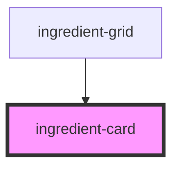

# ingredient-card

<!-- Auto Generated Below -->

## Properties

| Property    | Attribute    | Description | Type     | Default     |
| ----------- | ------------ | ----------- | -------- | ----------- |
| `imageSrc`  | `image-src`  |             | `string` | `undefined` |
| `name`      | `name`       |             | `string` | `undefined` |
| `targetUrl` | `target-url` |             | `string` | `undefined` |

## Dependencies

### Used by

 - [ingredient-grid](../ingredient-grid)

### Graph

----------------------------------------------

*Built with [StencilJS](https://stenciljs.com/)*
